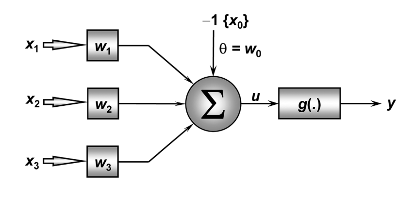
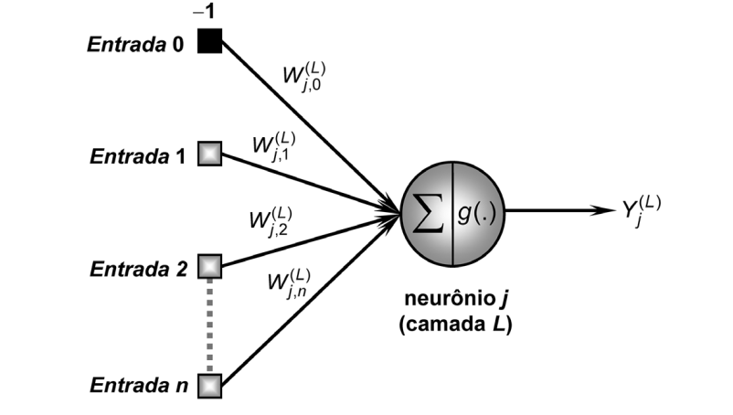
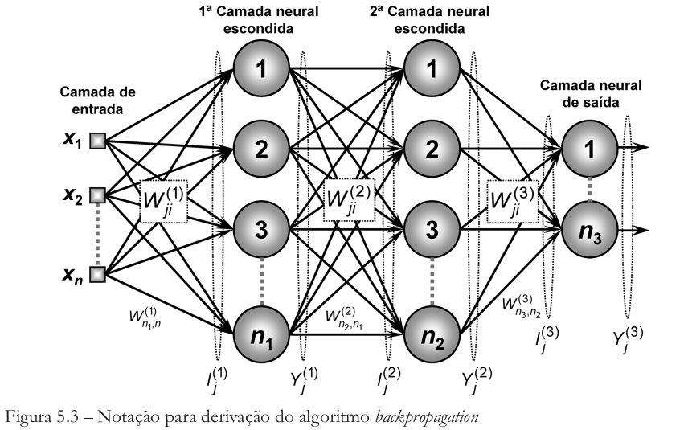
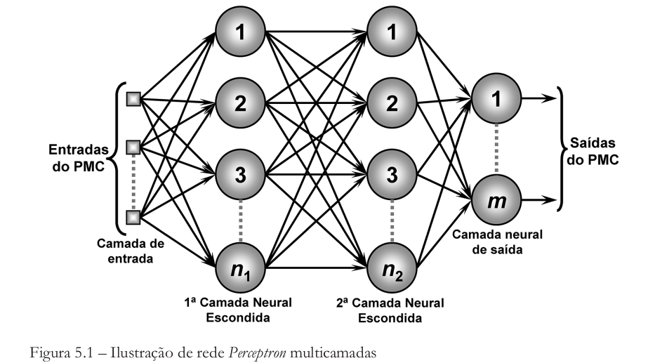

<strong>Referência utilizada: Redes Neurais Artificiais Para Engenharia e Ciências Aplicadas. Fundamentos Teóricos e Aspectos Práticos (Ivan Nunes da Silva, Danilo Hernane Spatti e Rogério Andrade Flauzino)</strong>
<h1><strong>Perceptron</strong></h1>

<h1><strong>Multilayer Perceptron</strong></h1>

